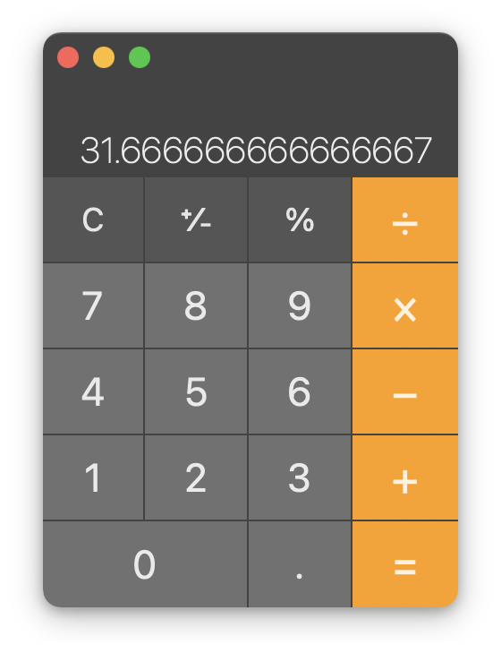

# calculator-project

# Description

A functional calculator created with the combination of HTMl, SCSS, Javascript logic and DOM manipulation.
# Goal
- Reproduce the calculator design below

# Requirements

## HTML/SCSS

- Create a calculator to be rendered to the html page
- it should have number keys from 0 to 9
- It should have operator keys (+, -, /, *, =)
- It should have a display rendering the current calculation in a box at the top
- It should also have a "." key
- You should choose a picture of a calculator from the Internet and reproduce it in HTML/SCSS

## JavaScript

- Should render the current calculation in a box at the top (calculator display)
- It should handle decimals
- It doesn't need to support orders of operation
- It should not use eval() or Function() constructor 

## Implementation Details

## Lifecycle

### Breakdown of logic pre-implementation
- The selected numbers will require to be rendered on the display
- The  value of the completed number (before pressing the desired operator) will need to be stored.
- The value of the completed second number (before pressing the equal button) will need to be stored, calculated and have the result rendered on the display.
- The values will be stored in an array and have calculation performed using functions and/or array iterator(s)