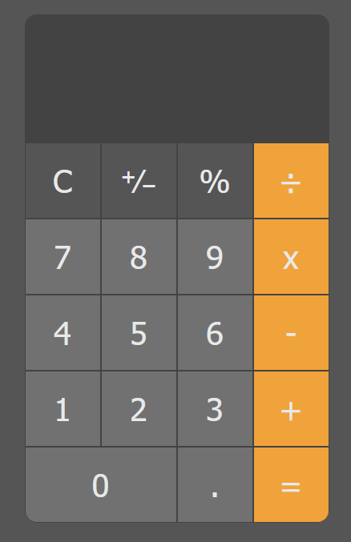

# calculator-project
https://samuel-b.github.io/calculator-project/

# Screenshot

# Description

A functional calculator created with the combination of HTML, SCSS, Javascript logic and DOM manipulation.
# Goal
- Reproduce the calculator design [here](#Design) with HTML and SCSS
- Apply javascript logic to perform calculations given the provided [requirements](#Requirements)
- Utilise DOM manipulation to display the logic on the calculator display
- Use validation and logic to reduce the possibility of any edge case to increase UX
# Requirements

## HTML/SCSS

- Create a calculator to be rendered to the html page
- it should have number keys from 0 to 9
- It should have operator keys (+, -, /, *, =)
- It should have a display rendering the current calculation in a box at the top
- It should also have a "." key
- You should choose a picture of a calculator from the Internet and reproduce it in HTML/SCSS

## JavaScript

- Should render the current calculation in a box at the top (calculator display)
- It should handle decimals
- It doesn't need to support orders of operation
- It should not use eval() or Function() constructor 

# Implementation Details

## Technology
- HTML
- SCSS
- Javascript
- Git & Github

## Design

## Lifecycle
Project was implemented a feature at a time on seperate branches, starting with the design, the logic, and then any touch-ups or additional features and merged with the main branch after review.

### Breakdown of logic pre-implementation
- The selected numbers will require to be rendered on the display
- The  value of the completed number (before pressing the desired operator) will need to be stored.
- The value of the completed second number (before pressing the equal button) will need to be stored, calculated and have the result rendered on the display.
- The values will be stored in an array and have calculation performed using functions and/or array iterator(s)

### Breakdown of logic post-implementation
- The value of the completed number (before pressing the desired operator) is stored in the previousValue variable.
- The value of the completed second number (before pressing the equal button) is stored in the currentValue variable.
- The values are stored in variables and the calculation is performed with the use of a switch statement dependant on the relevant operator using regex.
- For a more in-depth breakdown review my script.js comments [here](https://github.com/samuel-b/calculator-project/blob/main/script.js)

# In The Future

### What I want to implement in the future

-  Functionality to chain multiple operators together.

### Lessons learned with this project

1. There are multiple ways to solve the same problem and the even though the logic maybe correct prior to implementation it may not be the best or easiest solution for the problem.
